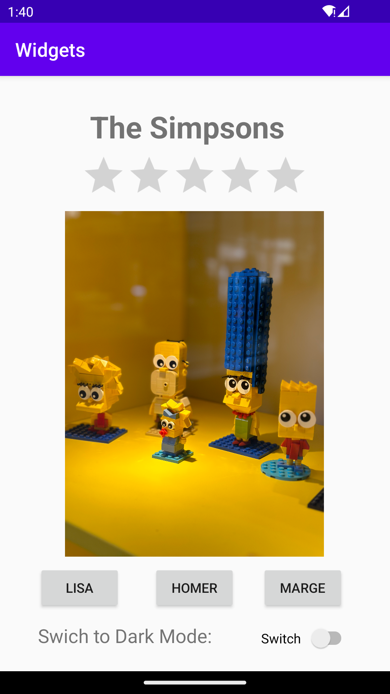

# Rapport

I used `ConstraintLayout` which already was implemented automatically.
```
<androidx.constraintlayout.widget.ConstraintLayout xmlns:android="http://
schemas.android.com/apk/res/android"
```

I added `ImageView`,`EditText` and `Rating Bar` and changed the constraints and size of the widgets.
Code was created automatically.
```
<ImageView
        android:id="@+id/imageView"
        android:layout_width="298dp"
        android:layout_height="397dp"
        app:layout_constraintBottom_toBottomOf="parent"
        app:layout_constraintEnd_toEndOf="parent"
        app:layout_constraintStart_toStartOf="parent"
        app:layout_constraintTop_toTopOf="parent"
        app:srcCompat="@drawable/img_1138" />

    <TextView
        android:id="@+id/textView2"
        android:layout_width="220dp"
        android:layout_height="49dp"
        android:text="The Simpsons"
        android:textSize="32sp"
        android:textStyle="bold"
        app:layout_constraintBottom_toTopOf="@+id/imageView"
        app:layout_constraintEnd_toEndOf="parent"
        app:layout_constraintHorizontal_bias="0.497"
        app:layout_constraintStart_toStartOf="parent"
        app:layout_constraintTop_toTopOf="parent"
        app:layout_constraintVertical_bias="0.262" />

    <RatingBar
        android:id="@+id/ratingBar"
        android:layout_width="240dp"
        android:layout_height="49dp"
        app:layout_constraintBottom_toTopOf="@+id/imageView"
        app:layout_constraintEnd_toEndOf="parent"
        app:layout_constraintHorizontal_bias="0.496"
        app:layout_constraintStart_toStartOf="parent"
        app:layout_constraintTop_toBottomOf="@+id/textView2"
        app:layout_constraintVertical_bias="0.285" />
```
I also added 3 `Buttons` for the Simpsons names and `Swich` widget to switch to dark mode 
which is not implemented yet. I also added one more `TextView`. 
```
 <Button
        android:id="@+id/button"
        android:layout_width="wrap_content"
        android:layout_height="wrap_content"
        android:layout_marginStart="40dp"
        android:layout_marginLeft="40dp"
        android:text="Lisa"
        app:layout_constraintBottom_toBottomOf="parent"
        app:layout_constraintStart_toStartOf="parent"
        app:layout_constraintTop_toBottomOf="@+id/imageView"
        app:layout_constraintVertical_bias="0.256" />

    <Button
        android:id="@+id/button2"
        android:layout_width="wrap_content"
        android:layout_height="wrap_content"
        android:layout_marginStart="75dp"
        android:layout_marginLeft="75dp"
        android:layout_marginEnd="72dp"
        android:layout_marginRight="72dp"
        android:text="Homer"
        app:layout_constraintBottom_toBottomOf="parent"
        app:layout_constraintEnd_toStartOf="@+id/button3"
        app:layout_constraintHorizontal_bias="0.525"
        app:layout_constraintStart_toEndOf="@+id/button"
        app:layout_constraintTop_toBottomOf="@+id/imageView"
        app:layout_constraintVertical_bias="0.256" />

    <Button
        android:id="@+id/button3"
        android:layout_width="wrap_content"
        android:layout_height="wrap_content"
        android:layout_marginEnd="40dp"
        android:layout_marginRight="40dp"
        android:text="Marge"
        app:layout_constraintBottom_toBottomOf="parent"
        app:layout_constraintEnd_toEndOf="parent"
        app:layout_constraintTop_toBottomOf="@+id/imageView"
        app:layout_constraintVertical_bias="0.256" />

    <Switch
        android:id="@+id/switch1"
        android:layout_width="96dp"
        android:layout_height="34dp"
        android:layout_marginStart="44dp"
        android:layout_marginLeft="44dp"
        android:text="Switch"
        app:layout_constraintBottom_toBottomOf="parent"
        app:layout_constraintEnd_toEndOf="parent"
        app:layout_constraintHorizontal_bias="0.024"
        app:layout_constraintStart_toEndOf="@+id/textView3"
        app:layout_constraintTop_toBottomOf="@+id/button3"
        app:layout_constraintVertical_bias="0.4" />

    <TextView
        android:id="@+id/textView3"
        android:layout_width="190dp"
        android:layout_height="28dp"
        android:layout_marginStart="40dp"
        android:layout_marginLeft="40dp"
        android:text="Swich to Dark Mode:"
        android:textSize="20sp"
        app:layout_constraintBottom_toBottomOf="parent"
        app:layout_constraintStart_toStartOwif="parent"
        app:layout_constraintTop_toBottomOf="@+id/button"
        app:layout_constraintVertical_bias="0.357" />
```

This is my Simpsons App view:


